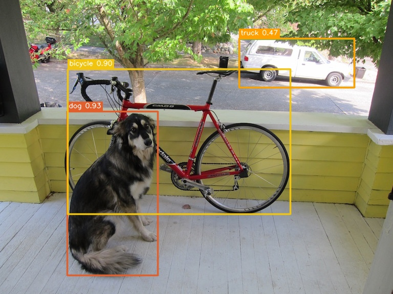
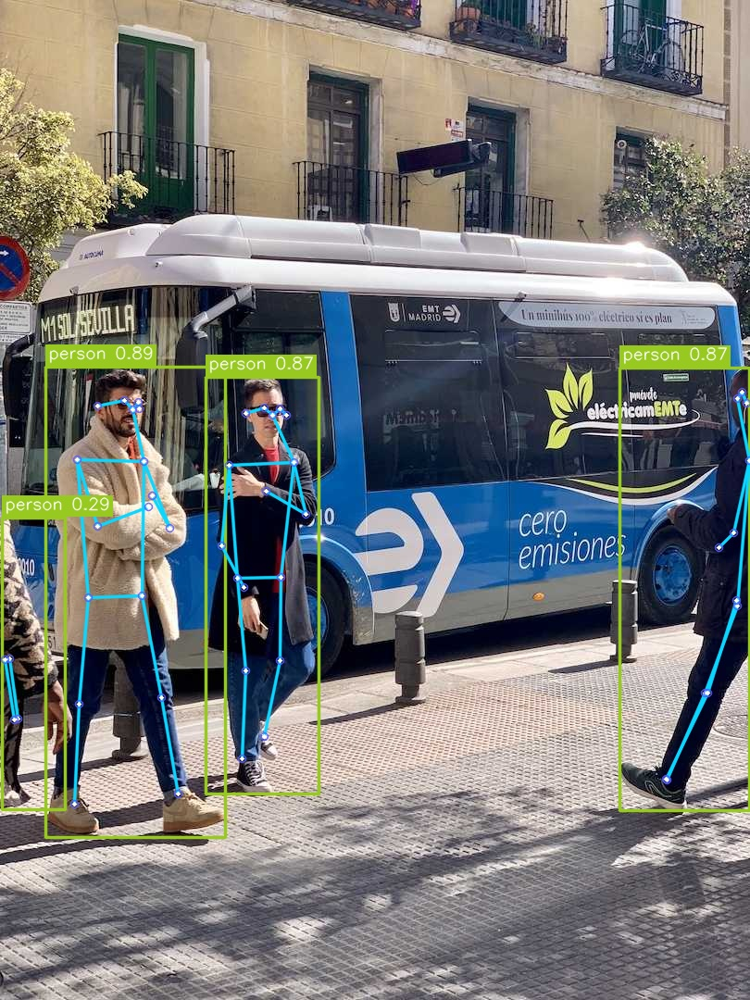

# YOLO-CPP

Minimal YOLO runtime in C++20 with a small facade API and task coverage for
`detect`, `classify`, `seg`, `pose`, and `obb`.

## Supported Tasks

- supports `detect`, `classify`, `seg`, `pose`, and `obb`
- includes integration tests and parity tooling
- includes both minimal examples and OpenCV visualization examples

## Prerequisites

- CMake 3.20+
- Ninja
- a C++20 compiler
- `vcpkg`

This repo assumes `VCPKG_ROOT` points at your local `vcpkg` checkout. The
presets are written for:

```bash
export VCPKG_ROOT="$HOME/.local/share/vcpkg"
```

The repo presets already carry the extra `vcpkg` environment this project
needs, so `cmake --preset ...` is the normal entry point.

## Quick Start

Choose one of these routes:

- `dev`: build the library plus the minimal PPM examples
- `dev-opencv`: build the library plus optional local OpenCV visualization examples in `Release`

### Minimal Route

Configure and build:

```bash
cmake --preset dev --fresh
cmake --build build/dev
```

Run detect:

```bash
./build/dev/examples/detect_image /path/to/model.onnx /path/to/image.ppm
```

Run classify:

```bash
./build/dev/examples/classify_image /path/to/model.onnx /path/to/image.ppm
```

If your input starts as `jpg` / `png`, convert it first:

```bash
magick input.jpg output.ppm
```

### OpenCV Visualization Route

This route is intentionally a local demo path, not part of the core library
baseline. The core `yolo_cpp` target stays renderer-agnostic; OpenCV is only
used by these example executables.

Install OpenCV for your machine first. On Debian/Ubuntu that usually means:

```bash
sudo apt install libopencv-dev
```

Configure and build:

```bash
cmake --preset dev-opencv --fresh
cmake --build --preset build-opencv
```

This preset is set up as a `Release` example route so the visualization path
matches the kind of build you would normally demo or screenshot.

If CMake cannot locate OpenCV automatically on your system, pass an explicit
package config path when configuring, for example:

```bash
cmake --preset dev-opencv --fresh -DOpenCV_DIR=/path/to/opencv/lib/cmake/opencv4
```

Run detect with saved output:

```bash
./build/dev-opencv/examples/detect_opencv_viz \
  /path/to/yolov8n.onnx \
  examples/assets/detect_demo.jpg \
  build/dev-opencv/test1.detect.jpg
```

Run pose with saved output:

```bash
./build/dev-opencv/examples/pose_opencv_viz \
  /path/to/yolov8n-pose.onnx \
  examples/assets/pose_demo.jpg \
  build/dev-opencv/test2.pose.jpg
```

These examples load `jpg` / `png` directly and save annotated output images.

Example outputs:





The source layout and helper split for both routes is summarized in
[`examples/README.md`](examples/README.md).

## Build Notes

### CPU

Use the `dev` preset from the quick start above.

### CUDA

Configure:

```bash
cmake --preset dev-cuda
```

Build:

```bash
cmake --build build/cuda
```

### Library-Only

```bash
cmake --preset dev -DYOLO_CPP_BUILD_EXAMPLES=OFF
cmake --build build/dev
```

## Tests

Testing is enabled by default with `BUILD_TESTING=ON`.

Build and run:

```bash
cmake --preset dev --fresh
cmake --build build/dev --target check
```

Or:

```bash
ctest --test-dir build/dev --output-on-failure
```

Test layers:

- `tests/unit`: helper contracts and semantics
- `tests/component`: decode, preprocess, postprocess behavior with synthetic data
- `tests/adapter`: Ultralytics probe/binding behavior and task constraints
- `tests/integration`: model-backed pipeline tests
- `tests/parity`: manual parity checks against Ultralytics Python

`unit` / `component` / `adapter` tests are model-free. Integration tests are
only added when the required ONNX assets exist under `tests/assets/models/`.

More detail lives in [`tests/README.md`](tests/README.md).

## Validation And Tools

- parity checks are available through the Python tooling under
  [`tests/parity`](tests/parity)
- integration tests are only added when the required ONNX assets exist under
  `tests/assets/models/`
- `pose` and `obb` include extra debug helpers for parity investigation

Run parity manually with the project test environment:

```bash
uv run python tests/parity/run_parity.py --check
```

Run the staged segmentation debug dump:

```bash
uv run python tests/parity/run_segmentation_debug.py
```

Run the staged pose debug dump:

```bash
uv run python tests/parity/run_pose_debug.py
```

Run the staged OBB debug dump:

```bash
uv run python tests/parity/run_obb_debug.py
```

More detail lives in [`tests/parity/README.md`](tests/parity/README.md),
[`tools/README.md`](tools/README.md), and
[`docs/vcpkg_overlay_onnx_fix.md`](docs/vcpkg_overlay_onnx_fix.md).
